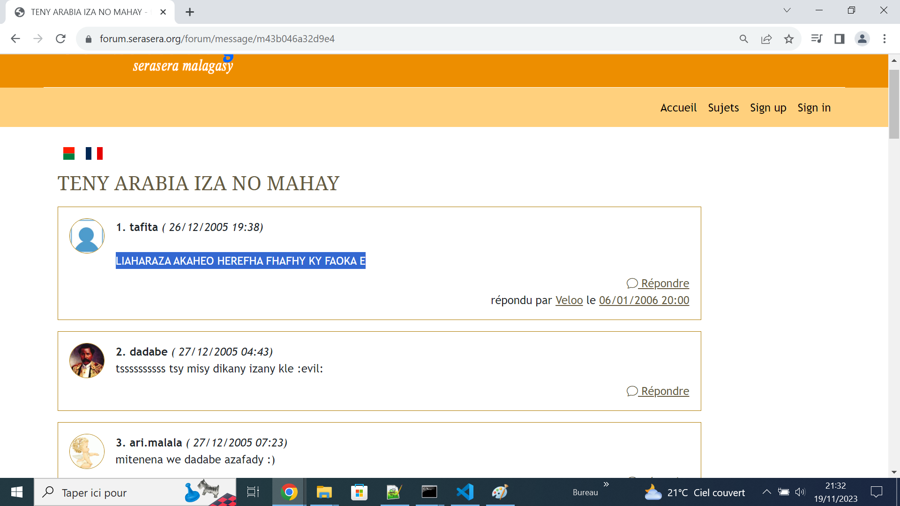

# arabia

`Chiffre` gasigasy na koa hoe `Système de chiffrement par substitution` tsotra kely sady fampiasan'ny sasany eto Dago indraindray.

Mampahatsiahy ny fahazazana ary indrindra indrindra ny [Code César](https://fr.wikipedia.org/wiki/Chiffrement_par_d%C3%A9calage) izay `fianarana mamindra` ho an'ireo rehetra mandalina *cryptographie*/*cryptanalyse* eo ampiandohana.

Nitsidika an'i **Serasera Malagasy** dia sendra azy, tsy naharitra ka niakatra ny aingampanahy... 😆😆😆

<p align="center"></p>


---


Miala any ary ny code **Rust**...

```rust
pub fn arb(text: &str) -> String {
    let input  = "BDFGHJKLMNPRSTVZbdfghjklmnprstvz";
    let output = "ZVTSRPNMLKJHGFDBzvtsrpnmlkjhgfdb";

    text.chars()
        .map(|c| match input.find(c) {
            Some(i) => output.chars().nth(i).unwrap(),
            None => c,
        })
        .collect()
}

fn main() {
    let str_in: &str = "LIAHARAZA AKAHEO HEREFHA FHAFHY KY FAOKA E";

    println!("Teny adika  <<<: {}", str_in);
    println!(">>> Dika mazava: {}", arb(str_in));
}
```

Raha hanadrana azy dia ampidiro hoe `cargo run` dia tsindrio `return`.

```
Teny adika  <<<: LIAHARAZA AKAHEO HEREFHA FHAFHY KY FAOKA E
>>> Dika mazava: MIARAHABA ANAREO REHETRA TRATRY NY TAONA E
```
Marihana fa sady fanaovana _encodage_ no ampiasana koa amin'ny _décodage_ `pub fn arb(text: &str) -> String`. Pimaso ho an'ireo namana rehetra mankafy Marika: Involution, na Fonction involutive no resaka izany 👀


---

Manaraka izany, tsy adino koa ny code **D**...


```d
import std.stdio : writeln;
import std.algorithm : map;
import std.conv: text;
import std.string: indexOf;
import std.typecons : Yes;

string arb(string text) {
    string input  = "BDFGHJKLMNPRSTVZbdfghjklmnprstvz";
    string output = "ZVTSRPNMLKJHGFDBzvtsrpnmlkjhgfdb";
	
    return text.map!(c => indexOf(input, c, 1, Yes.caseSensitive) != -1 ? output[indexOf(input, c, 1, Yes.caseSensitive)] : c).text;
}

void main() {
    string str_in = "LIAHARAZA AKAHEO HEREFHA FHAFHY KY FAOKA E";

    writeln;
    writeln("Teny adika  <<<: ", str_in);
    writeln(">>> Dika mazava: ", arb(str_in));
}
```

---

Farany nefa tsy bitika, indro ny code **Delphi**...

```delphi
program DelphiArb;

uses
  System.SysUtils, System.StrUtils;

function Arb(const Text: string): string;
const
  Input = 'BDFGHJKLMNPRSTVZbdfghjklmnprstvz';
  Output = 'ZVTSRPNMLKJHGFDBzvtsrpnmlkjhgfdb';
var
  CharMap: array [Char] of Char;
  Index: Integer;
begin
  for Index := Low(Input) to High(Input) do
    CharMap[Input[Index]] := Output[Index];

  Result := Text;
  for Index := 1 to Length(Result) do
    if CharMap[Result[Index]] <> #0 then
      Result[Index] := CharMap[Result[Index]];
end;

var
  StrIn: string;

begin
  StrIn := 'LIAHARAZA AKAHEO HEREFHA FHAFHY KY FAOKA E';

  Writeln('Teny adika  <<<: ', StrIn);
  Writeln('>>> Dika mazava: ', Arb(StrIn));

  Readln;

end.
```
